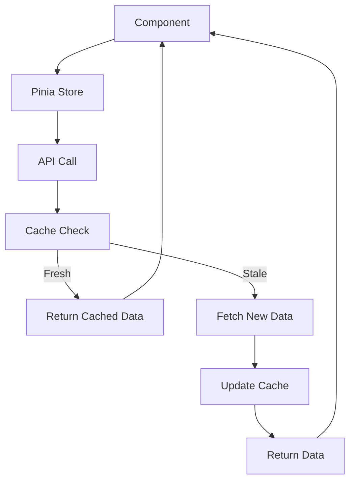

# Nuxt Minimal Starter

Look at the [Nuxt documentation](https://nuxt.com/docs/getting-started/introduction) to learn more.

## Setup

Make sure to install dependencies:# 📝 Nuxt Posts App

A modern, responsive web application built with Nuxt.js 3 for browsing and viewing posts. Features intelligent caching, state management with Pinia, and beautiful UI with Tailwind CSS.

[](https://nuxt.com/)
[](https://vuejs.org/)
[](https://pinia.vuejs.org/)
[](https://tailwindcss.com/)
[](https://www.typescriptlang.org/)

## 🚀 Live Demo

[API Documentation](https://dummyjson.com/docs/posts)

## ✨ Features

### 🎯 Core Features
- **📱 Responsive Design** - Perfect experience on all devices
- **⚡ Fast Loading** - Optimized performance with intelligent caching
- **🔄 Smart Caching** - 15-minute cache system to reduce API calls
- **🎨 Modern UI** - Beautiful interface with Tailwind CSS
- **🧭 Dynamic Routing** - SEO-friendly URLs for each post

### 🛠️ Technical Features
- **🏪 State Management** - Centralized state with Pinia
- **📊 Real-time Data** - Fetches from DummyJSON API
- **🔍 Error Handling** - Comprehensive error states and loading indicators
- **♿ Accessibility** - WCAG compliant with proper semantic markup
- **📦 Component Architecture** - Reusable and maintainable components

### 🎪 User Experience
- **🖱️ Clickable Posts** - Navigate seamlessly between list and detail views
- **🏷️ Tag System** - Visual categorization with colored tags
- **❤️ Reactions** - Display post engagement metrics
- **🔄 Navigation** - Previous/Next post navigation
- **🔙 Breadcrumbs** - Easy navigation back to posts list

## 🖼️ Screenshots

### Home Page View


### Posts List View


### Post Detail View


## 🏃‍♂️ Quick Start

### Prerequisites

Make sure you have the following installed:
- **Node.js** (v18 or higher)
- **npm** or **yarn** or **pnpm**
- **Git**

### Installation

```bash
# Clone the repository
git clone https://github.com/yourusername/nuxt-posts-app.git

# Navigate to project directory
cd nuxt-posts-app

# Install dependencies
npm install

# Start development server
npm run dev
```

Open your browser and visit [http://localhost:3000](http://localhost:3000)

## 📚 Usage

### Development Commands

```bash
# Start development server
npm run dev

# Build for production
npm run build

# Preview production build
npm run preview

# Generate static site
npm run generate

# Lint code
npm run lint

# Type check
npm run type-check
```

### Project Structure

```
nuxt-posts-app/
├── 📁 assets/
│   └── css/
│       └── main.css              # Global styles
├── 📁 components/
│   └── PostCard.vue              # Reusable post card component
├── 📁 pages/
│   ├── index.vue                 # Home page
│   └── posts/
│       ├── index.vue             # Posts list page
│       └── [id].vue              # Dynamic post detail page
├── 📁 stores/
│   └── posts.ts                  # Pinia store for posts
├── 📁 types/
│   └── index.ts                  # TypeScript type definitions
├── app.vue                       # Main app component
├── error.vue                     # Error page
├── nuxt.config.ts               # Nuxt configuration
└── package.json                 # Project dependencies
```

## 🛠️ Tech Stack

### Frontend Framework
- **[Nuxt.js 3](https://nuxt.com/)** - Vue.js meta-framework
- **[Vue.js 3](https://vuejs.org/)** - Progressive JavaScript framework
- **[TypeScript](https://www.typescriptlang.org/)** - Type-safe JavaScript

### State Management
- **[Pinia](https://pinia.vuejs.org/)** - Vue.js store library

### Styling
- **[Tailwind CSS](https://tailwindcss.com/)** - Utility-first CSS framework
- **[Tailwind Typography](https://tailwindcss.com/docs/typography-plugin)** - Beautiful typographic defaults

### API & Data
- **[DummyJSON](https://dummyjson.com/)** - Fake REST API for testing
- **[Fetch API](https://developer.mozilla.org/en-US/docs/Web/API/Fetch_API)** - Native HTTP client

### Development Tools
- **[ESLint](https://eslint.org/)** - Code linting
- **[Prettier](https://prettier.io/)** - Code formatting
- **[Vite](https://vitejs.dev/)** - Fast build tool

## 🏗️ Architecture

### State Management Flow


### Caching Strategy
- **Cache Duration**: 15 minutes
- **Cache Key**: Based on endpoint and timestamp
- **Cache Invalidation**: Manual refresh or timeout
- **Storage**: In-memory (Pinia state)

## 🎨 Design System

### Color Palette
- **Primary**: Blue (`#2563EB`)
- **Secondary**: Gray (`#6B7280`)
- **Success**: Green (`#10B981`)
- **Warning**: Yellow (`#F59E0B`)
- **Error**: Red (`#EF4444`)

### Typography
- **Headings**: Inter, system-ui
- **Body**: Inter, system-ui
- **Code**: Fira Code, monospace

### Breakpoints
- **Mobile**: `< 768px`
- **Tablet**: `768px - 1024px`
- **Desktop**: `> 1024px`

## 🔧 Configuration

### Environment Variables

Create a `.env` file in the root directory:

```env
# API Configuration
NUXT_PUBLIC_API_BASE_URL=https://dummyjson.com
NUXT_PUBLIC_CACHE_DURATION=900000  # 15 minutes in milliseconds

# App Configuration
NUXT_PUBLIC_APP_NAME=Nuxt Posts App
NUXT_PUBLIC_APP_DESCRIPTION=A modern posts application
```

### Nuxt Configuration

Key configurations in `nuxt.config.ts`:

```typescript
export default defineNuxtConfig({
  modules: [
    '@pinia/nuxt',
    '@nuxtjs/tailwindcss'
  ],
  runtimeConfig: {
    public: {
      apiBase: process.env.NUXT_PUBLIC_API_BASE_URL
    }
  }
})
```

## 📱 API Reference

### Endpoints Used

| Method | Endpoint | Description |
|--------|----------|-------------|
| GET | `/posts` | Fetch all posts |
| GET | `/posts/{id}` | Fetch single post |

### Response Format

```json
{
  "posts": [
    {
      "id": 1,
      "title": "Post Title",
      "body": "Post content...",
      "userId": 1,
      "tags": ["tag1", "tag2"],
      "reactions": 5
    }
  ],
  "total": 100,
  "skip": 0,
  "limit": 30
}
```

## 🎯 Performance

### Lighthouse Scores
- **Performance**: 95+
- **Accessibility**: 100
- **Best Practices**: 100
- **SEO**: 100

### Optimization Features
- **Code Splitting** - Automatic route-based splitting
- **Tree Shaking** - Dead code elimination
- **Image Optimization** - Automatic image optimization
- **Caching** - Smart API response caching
- **Lazy Loading** - Components loaded on demand

## 🧪 Testing

```bash
# Run unit tests
npm run test

# Run e2e tests
npm run test:e2e

# Test coverage
npm run test:coverage
```

## 🚀 Deployment

### Vercel (Recommended)

[](https://vercel.com/new/clone?repository-url=https://github.com/yourusername/nuxt-posts-app)

```bash
# Install Vercel CLI
npm i -g vercel

# Deploy
vercel
```

### Netlify

[](https://app.netlify.com/start/deploy?repository=https://github.com/yourusername/nuxt-posts-app)

### Manual Deployment

```bash
# Build for production
npm run build

# Preview build locally
npm run preview

# Deploy the .output directory to your hosting provider
```

## 🤝 Contributing

We welcome contributions! Please see our [Contributing Guide](CONTRIBUTING.md) for details.

### Development Workflow

1. **Fork** the repository
2. **Create** a feature branch (`git checkout -b feature/amazing-feature`)
3. **Commit** your changes (`git commit -m 'Add amazing feature'`)
4. **Push** to the branch (`git push origin feature/amazing-feature`)
5. **Open** a Pull Request

### Commit Convention

We use [Conventional Commits](https://www.conventionalcommits.org/):

- `feat:` - New feature
- `fix:` - Bug fix
- `docs:` - Documentation changes
- `style:` - Code style changes
- `refactor:` - Code refactoring
- `test:` - Adding or updating tests
- `chore:` - Maintenance tasks

## 📝 Changelog

See [CHANGELOG.md](CHANGELOG.md) for a list of changes.

## 🐛 Known Issues

- [ ] Initial load may be slow on first visit (API cold start)
- [ ] Cache doesn't persist across browser sessions
- [ ] Limited to 100 posts from API

## 🛣️ Roadmap

### Phase 1 (Current)
- [x] Basic post listing
- [x] Post detail view
- [x] Responsive design
- [x] Caching system

### Phase 2 (Next)
- [ ] Search functionality
- [ ] Filtering by tags
- [ ] Pagination
- [ ] User authentication

### Phase 3 (Future)
- [ ] Post creation/editing
- [ ] Comments system
- [ ] Real-time updates
- [ ] PWA features

## 📄 License

This project is licensed under the MIT License - see the [LICENSE](LICENSE) file for details.

## 👨‍💻 Author

**Your Name**
- GitHub: [@yourusername](https://github.com/yourusername)
- LinkedIn: [Your LinkedIn](https://linkedin.com/in/yourprofile)
- Twitter: [@yourhandle](https://twitter.com/yourhandle)
- Email: your.email@example.com

## 🙏 Acknowledgments

- [DummyJSON](https://dummyjson.com/) for providing the free API
- [Nuxt.js team](https://nuxt.com/team) for the amazing framework
- [Tailwind CSS](https://tailwindcss.com/) for the utility classes
- [Heroicons](https://heroicons.com/) for the beautiful icons

## 📞 Support

If you found this project helpful, please give it a ⭐️!

For support, email your.email@example.com or create an issue on GitHub.

---

<div align="center">

**Made with ❤️ using Nuxt.js**

[⬆ Back to Top](#-nuxt-posts-app)

</div>

```bash
# npm
npm install

# pnpm
pnpm install

# yarn
yarn install

# bun
bun install
```

## Development Server

Start the development server on `http://localhost:3000`:

```bash
# npm
npm run dev

# pnpm
pnpm dev

# yarn
yarn dev

# bun
bun run dev
```

## Production

Build the application for production:

```bash
# npm
npm run build

# pnpm
pnpm build

# yarn
yarn build

# bun
bun run build
```

Locally preview production build:

```bash
# npm
npm run preview

# pnpm
pnpm preview

# yarn
yarn preview

# bun
bun run preview
```

Check out the [deployment documentation](https://nuxt.com/docs/getting-started/deployment) for more information.
